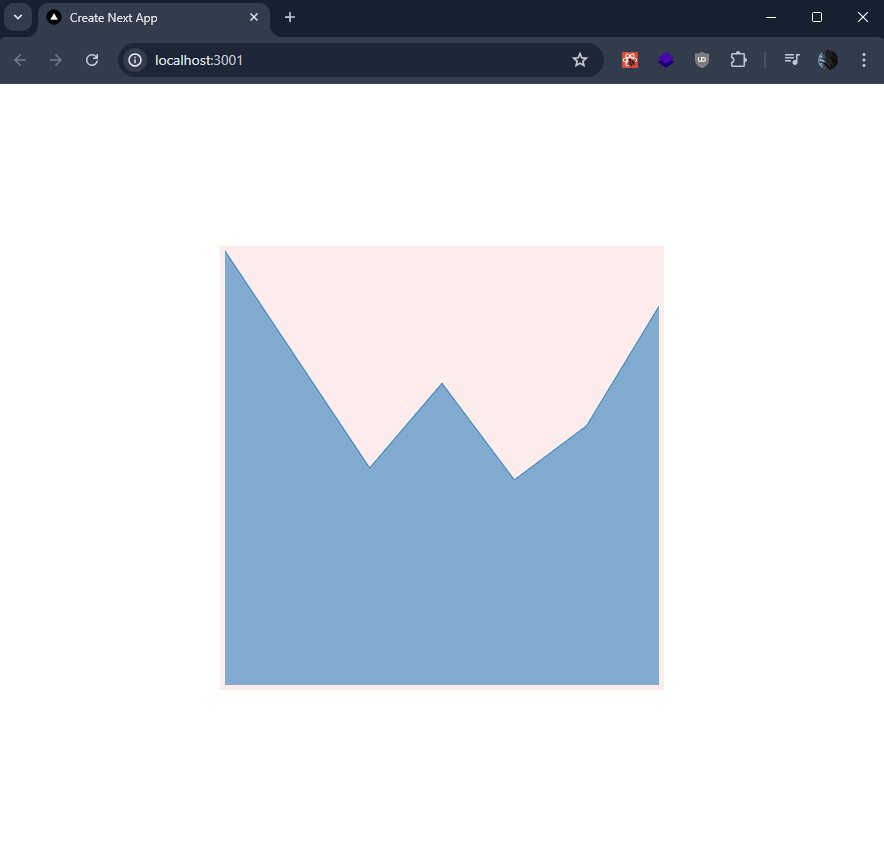
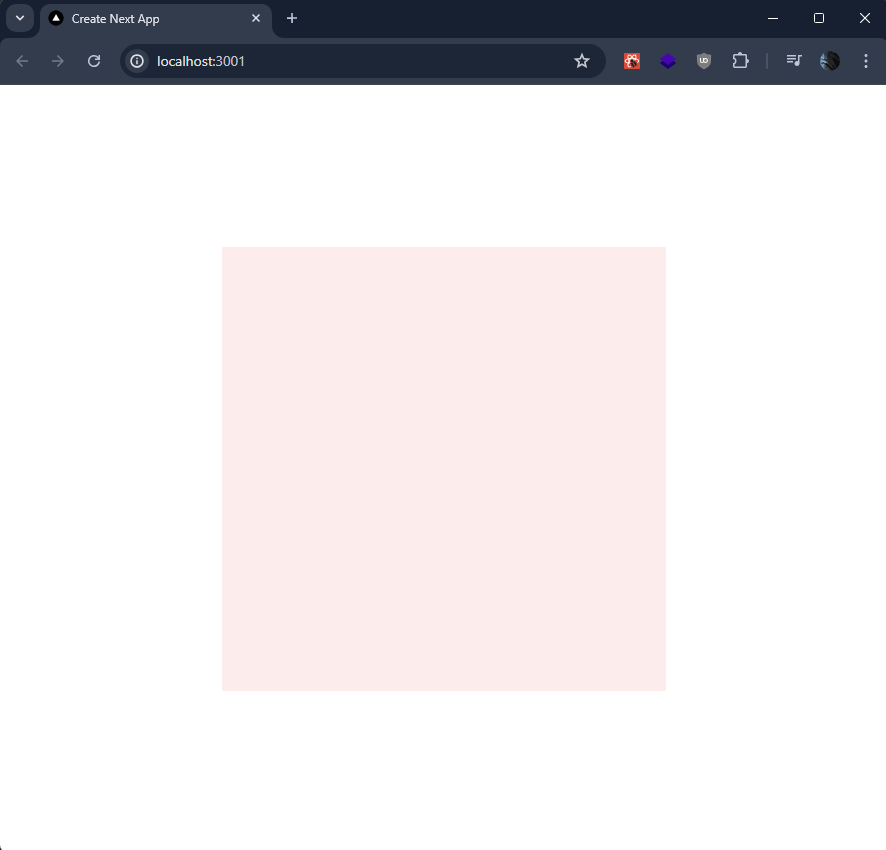

# Rechart broken in Nextjs 15

## The issue

Here it is working in nextjs 14


Here it is broken in nextjs 15


## Getting Started

First, run the development server:

```bash
npm run dev
# or
yarn dev
# or
pnpm dev
# or
bun dev
```

Open [http://localhost:3000](http://localhost:3000) with your browser to see the result.
